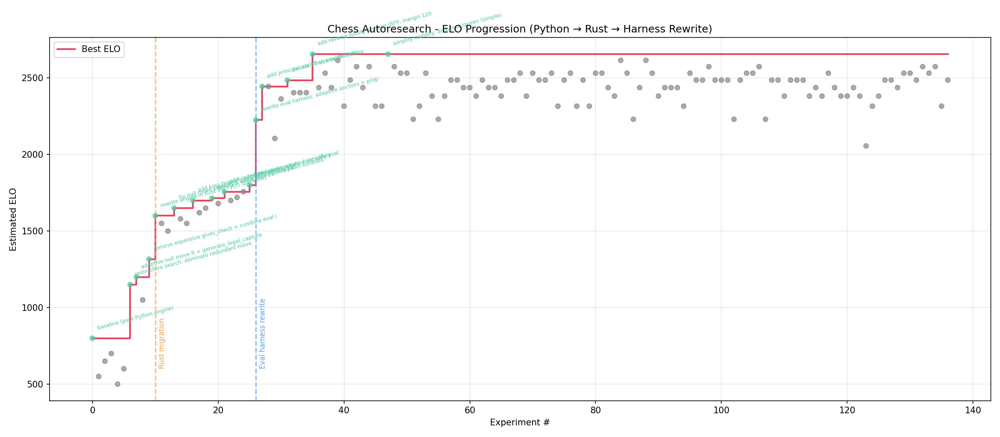

# chess-autoresearch

Give an AI agent a chess engine and let it experiment overnight. It modifies search heuristics, evaluation terms, and pruning strategies, plays against Stockfish to measure strength, keeps improvements, discards regressions, and repeats. You wake up to a stronger engine.

Inspired by [karpathy/autoresearch](https://github.com/karpathy/autoresearch).

## How it works

The engine is a classical alpha-beta searcher written in Rust (~1300 lines), with hand-crafted evaluation — no neural networks, no training data. The agent's only job is to edit `src/lib.rs` and see if the ELO goes up.

Each experiment:
1. Agent modifies the Rust engine (`src/lib.rs`)
2. Rebuilds (`maturin develop --release`)
3. Plays 10 games against Stockfish at adaptive difficulty levels
4. Keeps the change if ELO improved, reverts if not
5. Repeats

The evaluation harness automatically centers Stockfish's strength around the engine's current rating, so games are always competitive. ELO is estimated via binary search over the standard logistic formula.

**Key files:**
- `src/lib.rs` — Rust engine. The only file the agent modifies.
- `eval_harness.py` — plays games vs Stockfish, estimates ELO.
- `program.md` — agent instructions. Point your agent here and let it go.
- `engine.py` — thin Python wrapper between the harness and Rust.

## Quick start

**Requirements:** Python 3.10+, [uv](https://docs.astral.sh/uv/), Stockfish, Rust toolchain.

```bash
# Install dependencies
brew install stockfish          # macOS (or apt install stockfish)
curl -LsSf https://astral.sh/uv/install.sh | sh
curl --proto '=https' --tlsv1.2 -sSf https://sh.rustup.rs | sh -s -- -y

# Build and run
source "$HOME/.cargo/env"
uv run maturin develop --release
uv run eval_harness.py          # benchmark (~2-3 min)
uv run play.py                  # play against it
```

## Running autoresearch

```
Read program.md and follow the instructions exactly. Use the run tag "apr1". Start the setup, then kick off the experiment loop. Do not stop until I interrupt you.
```

The agent creates a branch, establishes a baseline, and starts experimenting autonomously. Each experiment takes ~2-3 minutes (~20-30 per hour, ~200+ overnight).

## Results

137 experiments across three phases: pure Python engine, Rust rewrite, and eval harness improvements. The engine went from ~800 to ~2650 estimated ELO.



## License

MIT
